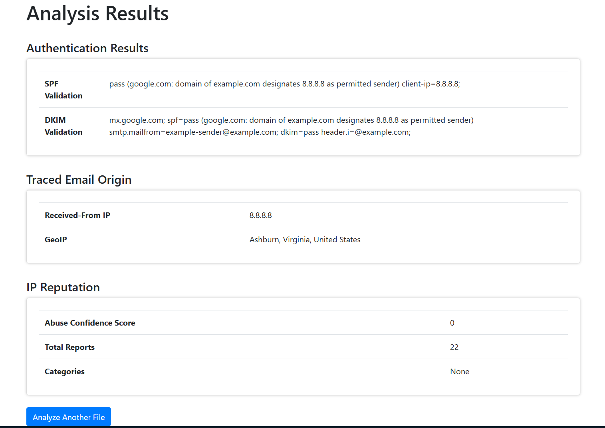

# 📧 EMAIL ANALYZER TOOL 📧  
### Uncover the Secrets Behind Email Headers!  

---

## 🚀 Introduction  
Ever wondered about the authenticity of emails in your inbox? 🕵️‍♀️ Worry no more! The **Email Analyzer Tool** simplifies the process of analyzing email files (`.eml`) and provides detailed insights. From validating SPF/DKIM to tracing email origins and geolocating IP addresses, this tool is your ultimate mail forensics sidekick! Analyze emails, detect suspicious IPs, and visualize sender locations effortlessly. ✨  

---

## 🎯 Features & Tools Used  
Built lovingly using:  
- **Python** 🐍  
- **Flask Web Framework** 🌐  
- **Folium for Maps** 🌏  
- **Bootstrap for UI** ✨  

Key Features:  
- **SPF/DKIM Validation**: Verify the sender’s identity and ensure security.  
- **Email Origin Tracing**: Decode mysterious `Received` headers.  
- **IP Reputation Check**: Spot suspicious IP addresses using AbuseIPDB.  
- **Geolocation Mapping**: Track sender location on an interactive map.  
- **Modern Web Interface**: Sleek UI for seamless analysis.  

---

## 🔍 How It Works  
### 🖋️ Step-by-Step Magic:
1. Upload `.eml` email files via the Web UI.  
2. Extract juicy details like `Received` IP addresses via the tool.  
3. Perform GeoIP lookups – does the sender look legitimate? 🤔  
4. Validate SPF and DKIM statuses to ensure authenticity and security.  

---


## ✨ Sample Output  

### Screenshot of the Web UI:


---

## 💻 Installation Instructions  
### 🏃 Getting Started:
1. Clone the repository:
   ```bash
   git clone https://github.com/omegaabot/hh8-minor-project-1.git
   ```

2. Navigate to the project folder:
   ```bash
   cd hh8-minor-project-1
   ```

3. Install dependencies:
   ```bash
   pip install -r requirements.txt
   ```

4. Add your AbuseIPDB API key in `config.py`:
   - Open `config.py` and replace `your-api-key-here` with your actual AbuseIPDB API key:
     ```python
     ABUSEIPDB_API_KEY = "your-api-key-here"
     ```

5. Run the Flask app:
   ```bash
   python email_analyzer_web.py
   ```

6. Open the URL [http://127.0.0.1:5000](http://127.0.0.1:5000) in your browser.

---

## 🤓 Tips & Tricks  
- **Suspicious IPs?** Use IP reputation checks to detect malicious senders.  
- **Debug Email Origin:** Trace all `Received` hops to pinpoint the true sender.  
- **Geolocation Insights:** Spot anomalies in sender locations for added confidence.  

---

## 🌟 Use Cases  
### Practical Scenarios to Use This Tool:
- **Cybersecurity Enthusiasts**:  
  Analyze phishing attempts and spoofed emails to prevent attacks.  
- **IT Professionals**:  
  Identify spam emails and troubleshoot company email security settings.  
- **Investigative Journalists**:  
  Verify the authenticity and origin of anonymous sources.  
- **Everyday Users**:  
  Validate unknown senders and keep inboxes secure.  

---

## 🔮 Future Roadmap  
What’s next for this amazing tool?  
- 🖋️ Add support for exporting results to `.json`, `.csv`, and `.pdf`.  
- 🧠 Integrate AI models for smarter detection of phishing attempts.  
- 📊 Develop enhanced visualizations like heatmaps for sender locations.  
- 🌎 Expand localization for worldwide IP origin tracking.  
- 🔒 Ensure additional SPF/DKIM validation insights like DMARC alignment.  

---

## 🎉 Conclusion  
The **Email Analyzer Tool** is your reliable gadget for uncovering hidden details in email headers. Whether you’re a cybersecurity enthusiast, an IT pro, or just a curious user, this tool empowers you to be the detective you were meant to be! 🚀  

So fire up the analyzer and start decoding those mysterious emails! 🌟  
